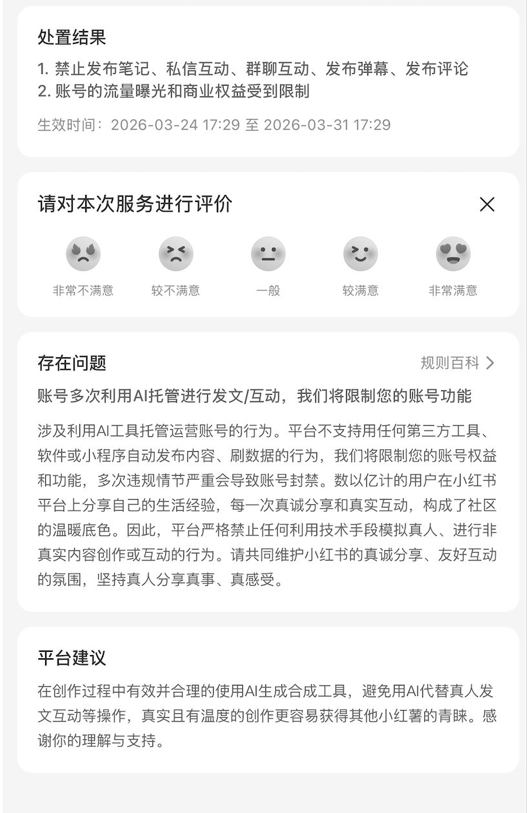

# xhs-scraper-skill

> 基于 [TikHub API](https://tikhub.io) 的小红书数据抓取工具，适用于 [Claude Code](https://claude.ai/claude-code) 和 **Openclaw**。

---

## 能做什么

用自然语言告诉 Claude 你要抓什么，不需要写代码，不需要记命令。Claude 会自动识别意图、从链接中提取 ID、自动翻页，并导出结果。

```
帮我抓取这条小红书笔记的数据：https://www.xiaohongshu.com/explore/68304ca2...

抓取用户「美食探店小王」的所有笔记，导出成 Excel

搜索小红书上关于「护肤」的用户，列出粉丝数排名

获取这个笔记的所有评论
```

**支持功能：**
- 按关键词搜索用户
- 获取用户主页数据（粉丝数、发帖数、简介等）
- 获取用户所有笔记（自动翻页）
- 获取笔记详情（标题、正文、互动数、封面图、话题标签）
- 获取笔记评论
- 按话题获取笔记 / 获取首页推荐
- 导出为 Excel / JSON

---

## 快速开始

### 第一步 — 安装 Skill

```bash
npx xhs-scraper-skill
```

安装完成后，skill 文件会复制到 `~/.claude/skills/xhs-scraper/`。

---

### 第二步 — 获取 TikHub API Key

1. 前往 [user.tikhub.io](https://user.tikhub.io) 注册账号
2. 在控制台中复制你的 API Key

> TikHub 提供小红书底层数据接口。计费方式：约 **$0.001/次**，成功请求会缓存 24 小时（重复请求不额外计费）。详细定价见 [TikHub Pricing](https://user.tikhub.io/dashboard/pricing)。

---

### 第三步 — 配置 API Key

编辑 `~/.claude/settings.json`，添加以下内容：

```json
{
  "env": {
    "TIKHUB_API_KEY": "你的-api-key"
  }
}
```

---

### 第四步 — 安装 Python 依赖

```bash
pip3 install httpx
```

---

### 第五步 — 重启 Claude Code

重启后 skill 自动生效。试试这句话：

```
帮我抓取这条小红书笔记的数据：https://www.xiaohongshu.com/explore/68304ca2...
```

---

## 环境要求

| 要求 | 说明 |
|------|------|
| Claude Code | [claude.ai/claude-code](https://claude.ai/claude-code) |
| Node.js | ≥ 18（安装脚本需要） |
| Python 3 + `httpx` | `pip3 install httpx` |
| TikHub API Key | [user.tikhub.io](https://user.tikhub.io) 注册获取 |

---

## 支持的接口

| 功能 | 接口路径 |
|------|---------|
| 搜索用户 | `GET /api/v1/xiaohongshu/web/search_users` |
| 获取用户信息 | `GET /api/v1/xiaohongshu/app/get_user_info` |
| 获取用户笔记列表 | `GET /api/v1/xiaohongshu/app/get_user_notes` |
| 获取笔记详情 | `GET /api/v1/xiaohongshu/app/get_note_info` |
| 获取笔记评论 | `GET /api/v1/xiaohongshu/app/get_note_comments` |
| 按话题获取笔记 | `GET /api/v1/xiaohongshu/app/get_notes_by_topic` |
| 首页推荐 | `GET /api/v1/xiaohongshu/web/get_home_recommend` |

---

## 如何从链接中找到 ID

**用户 ID** — 来自主页链接：
```
https://www.xiaohongshu.com/user/profile/5c1b1234...
                                          ^^^^^^^^^^^
                                          这就是 user_id
```

**笔记 ID** — 来自笔记链接：
```
https://www.xiaohongshu.com/explore/68304ca200000000...
                                    ^^^^^^^^^^^^^^^^
                                    这就是 note_id
```

> 不需要手动提取 ID，直接把完整链接发给 Claude，它会自动处理。

---

## 笔记详情字段说明

| 字段 | 含义 |
|------|------|
| `title` | 笔记标题 |
| `desc` | 笔记正文 |
| `type` | `"normal"`（图文）或 `"video"`（视频） |
| `liked_count` | 点赞数 |
| `collected_count` | 收藏数 |
| `comments_count` | 评论数 |
| `shared_count` | 分享数 |
| `view_count` | 浏览数 |
| `topics` | 话题标签列表 |
| `time` | 发布时间戳（秒） |
| `ip_location` | 发布 IP 归属地 |
| `images_list` | 图片列表（多档清晰度） |
| `video` | 视频信息（视频笔记专有） |

> ⚠️ 原始响应中 `interact_info` 字段始终为空，Skill 会自动读取顶层的 `liked_count` 等字段，无需关心。

---

## 常见问题

| 报错 | 可能原因 | 解决方法 |
|------|---------|---------|
| `400` | 笔记已删除，或需要分享链接 | 换用完整的分享链接（而不是单独的 note_id） |
| `401` | API Key 未配置 | 检查 `~/.claude/settings.json` 中的 `TIKHUB_API_KEY` |
| `429` | 触发限流 | Skill 已自动加延迟，稍等片刻后重试 |
| 请求超时 | VPN 或代理冲突 | 尝试切换 VPN 状态，`api.tikhub.io` 可能需要直连 |
| 封面链接失效 | CDN 链接带时效签名 | 抓到封面链接后立即下载，不要只保存 URL |

---

## 为什么做这个

因为我的小红书账号被限流了。



**违规原因：** 账号多次利用 AI 托管进行发文/互动，平台检测到自动化行为，限制了账号的发布、评论、私信等功能，有效期一周。

在这之前，我用了不少工具来采集小红书数据，包括：

- 基于 Playwright 的爬虫脚本（需要登录账号）
- Openclaw 的小红书笔记监控流程
- 各种 `xiaohongshu-cli` 类型的命令行工具

这些工具有一个共同点：**都需要登录我的小红书账号**。而小红书现在升级了 AI 自动化检测，只要账号有可疑的自动化行为，就会被无差别封控——哪怕你只是在采集数据、没有发布任何内容。

**这个 Skill 的解决思路完全不同。** 它调用的是 TikHub 的第三方数据接口，TikHub 通过自己的基础设施访问小红书的公开数据。你不需要登录小红书账号，不需要打开浏览器，也不会产生任何账号操作记录。你的账号安全。

> 本工具仅用于读取和分析小红书**公开数据**，请勿用于自动化互动（发帖、点赞、评论）等可能违反平台规则的行为。

---

## 开源协议

MIT
